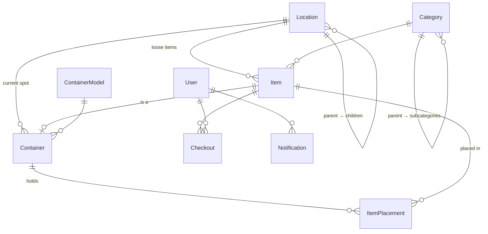

# Stash v2 — Storage & Unpacking Spec

**Back to:** [[stash|Stash — Inventory & Move Manager]]

> Drafted 2026-09-28 from a phone-test walkthrough with James. Replaces the "move to NC" focus for now. Open questions are marked **❓**.

> **Repo copy:** `D:\Code\personal\stash\SPEC.md` — keep both identical. Design reasoning: `BUILD_LOG.md` ch. 25; decisions: `LEARN.md` ADR-001–006.

## Progress

- [x] v1.3.0 — Expo SDK 57, mobile Change Password (branch `upgrade/expo-sdk-57`, not yet merged/deployed)
- [x] Spec, data model, build order agreed (2026-09-28)
- [~] **Phase 0 — Foundation** — built + rehearsed on a production copy (v1.4.0); **deploy + prune await James's OK**
- [~] **Phase 1 — Find it** — built + tested locally (v1.5.0); **awaiting deploy + phone test**
- [ ] **Phase 1b — Visual storage maps** — garage layout captured; storage unit details pending the visit
- [ ] Phase 2 — Quick Add (manual)
- [ ] Phase 3 — Ready for Storage + labels
- [ ] Phase 4 — Check out, transfer, archive, delete
- [ ] Phase 5 — Reminders
- [ ] Phase 6 — AI photo fill

Details for each phase: [Build order](#build-order).

---

## Why

We rent 1642 W Blue Flax Dr (Saratoga Springs, UT) and have more stuff than house. Long-term items live in a storage unit; frequently used items live on overhead garage shelves. We're unpacking old storage and re-packing into standard totes. The core problem: **know what's in a tote without opening it, and find any item fast.**

**Rule: everything must be doable 100% from the phone.** The admin website stays for bulk work (imports, printing sheets), not for anything required.

**Back-burnered:** NC move, destination rooms, Home Mode "move" features, fate-based move planning.

---

## Core model: Item → Container → Location

"Where is it?" follows the chain: *Baseball cards* → in container **#12** → on **Garage › Overhead Shelf 2**.

- **Item** — anything we own. Has a photo, name, category, details.
- **Container** — any item can become one (tote, bin, cedar chest). Holds items (and other containers).
- **Location** — a place with spots inside it. Containers live at locations; loose items can too.

---

## Locations — 1642 W Blue Flax Dr + storage unit

Hierarchical: **Place › Area › Spot**. In the app, names are always spelled out in full. Each spot also has an optional **short code** (e.g. `GAR-HS-02`, `U-R5-S3`) that can be printed on labels.

| Place | Area | Spots |
|---|---|---|
| Blue Flax — Main Floor | Kitchen | |
| | Pantry | |
| | Garage | Overhead Shelf 1–9 (see garage map), Garage Floor |
| Blue Flax — Basement | 3D Printer Area | |
| | Under Stairs Storage | |
| Blue Flax — 2nd Floor | James Office (Bedroom 4) | James Hobby Desk (closet) |
| | Theo's Room (Bedroom 3) | Theo's Closet |
| | Sophie's Room (Bedroom 2) | Sophie's Closet |
| | Master Bedroom | Master Closet, Master Bath |
| | Kids Bathroom (Bath 2) | |
| Lehi Indoor Storage — Unit 3204 (10×10) | Rack 1–6 | Shelf 1–5 each (incl. top) |
| | Unit Floor | |

- Rooms not listed (laundry, mudroom, living room, etc.) are left out; can be added from the phone anytime.

### Garage overhead shelves (revised 2026-09-29)

Numbered **clockwise starting at the north-east** (north = house side / mudroom steps; south = garage door). Each wall shelf is **36" deep** from the wall. Capacities are in 27-gal totes, long side into the depth.

| Shelf | Position | Layout | Approx. capacity |
|---|---|---|---|
| 1 | North wall, right of steps | ~4 wide × 2 high | 8 |
| 2 | East wall, north half | ~6 wide × 2 high (~6" spare in front) | 12 |
| 3 | East wall, south half — lower (garage door) | ~6 wide × 1 high + a 14-gal fits on top of each 27-gal | 6 (+6 small) |
| 4 | South wall, above garage door — lower | ~7 wide × 1 high + 14-gal on top | 7 (+7 small) |
| 5 | West wall, south half — lower | ~6 wide × 1 high + 14-gal on top | 6 (+6 small) |
| 6 | West wall, north half | ~6 wide × 2 high | 12 |
| 7 | North wall, left of steps | ~4 wide × 2 high | 8 |
| 8 | Center, over left car — lower | ~6 wide × 2 deep (back to back) × 1 high + 14-gal on top | 12 (+12 small) |
| 9 | Center, over right car — lower | ~6 wide × 2 deep × 1 high + 14-gal on top | 12 (+12 small) |

Red (1, 2, 6, 7) = full height, 27-gal totes stacked 2 high. Purple (3, 4, 5) and green (8, 9) = ~1.5 totes of headroom: one 27-gal per slot, and a 14-gal fits on top. Totes **stack directly on each other** (no divider), so the app should say when a tote is *under* another. The NE (1/2) and NW (6/7) corners are **usable but harder to reach** — mark those slots as "hard to reach". Exact shelf measurements pending (James).

Storage unit racks: exact rack/shelf counts, measurements and a photo coming from James's visit (2026-09-29).
- New locations can be created **inline** while storing a container.
- Racks: ~2 × 27-gal totes side by side per shelf; height fits one tote. Exact dimensions TBD once built.
- **Printable location legend**: a full-sheet sign for each area (e.g. the rack wall) with a photo/diagram showing how racks and shelves are numbered, to post at the location.
- **Numbering (decided):** Shelf 1 = **bottom**; racks numbered **left to right** (Rack 1 = leftmost). The printed legend shows this at the unit.

---

## Containers

### Types

| Brand | Sizes | Body | Lids |
|---|---|---|---|
| HDX (Home Depot) | 6.5 qt, 14 gal, 27 gal, 40 gal | Clear or Black | Red, Yellow, Green (14 & 27 gal share lids) |
| Sam's Club Tough Box | 27 gal | | |
| Walmart Sterilite | 27 gal (Large Storage Bin) | | |
| Custom (any item) | dimensions optional | | e.g. Cedar Chest |

Interior dimensions to be looked up from manufacturer specs, not guessed. Legacy types (U-Box, boxes, 35-gal) stay for existing data.

### Identifier
- **Just a number** — `12`. Unique across all containers, never reused.
- Brand, size, lid color live as **fields** (shown in app and optionally on the label), not in the ID — a swapped lid can't make a printed ID wrong.
- Existing physical numbers are honored when possible.

### Lifecycle
```
Packing ──"Ready for Storage"──► Stored at spot ──transfer──► Away (e.g. home for the season)
   ▲                                   │  ▲                          │
   └──── add more items ◄──────────────┘  └──── return to home spot ◄┘
```

**Ready for Storage** (one step):
1. Assigns the number + QR code.
2. Asks **where it's going** (pick a spot or create one).
3. Label: **Print / Share / Skip**. Skip flags *label not printed* → reminder until marked printed.

**Adding to an already-stored container:** no new label; confirm the label is still on it; confirm whether it's going back to the same spot or a new one.

**Transfer (seasonal):** move a whole container (e.g. Christmas decorations → house). It **remembers its home spot**, which shows as *reserved — temporarily empty*. "Return" puts it back.

---

## Adding an item (phone)

1. **+** opens the **camera**. Take a photo.
2. **AI fills in** name, category, description, details from the photo. Anything it can't identify is typed manually.
   - **Books:** AI reads title/author → free OpenLibrary / Google Books lookup adds ISBN, publisher, year, cover.
3. Edit/confirm fields.
4. **Put it in a container** (pick existing, scan its QR, or start a new one).
5. If the container is new/ready → the Ready-for-Storage flow above.

> ⚠️ In-app AI reverses the v1.2.0 "$0 AI" decision. Requires `ANTHROPIC_API_KEY` on the server; small per-photo cost. ❓ Exact pricing to confirm before building.

---

## Scanning a container QR

Scanning a container's label opens the **container screen**: its number, type/colors, location (and home spot if away), label status, and the **full list of items inside** (with photos).

---

## Finding & checking out an item

1. Search → item shows **"In #12 — Lehi Storage Unit 3204 › Rack 5 › Shelf 3"**.
2. Retrieve it, put the tote back.
3. **Check Out** asks: how long? will it be stored again? purpose (optional).
4. Item becomes **In Use** — still linked to its home container.
5. Automatic reminders: *Are you done? Was it returned?*

### Item states
| State | Meaning |
|---|---|
| **Stored** | In a container / at a location |
| **In Use** | Checked out, still belongs to its container, reminders active |
| **Archived** (in regular use) | Not going back to storage. Stays in the catalog under its category so we don't re-add it when packing again |
| **Sold / Disposed** | Removed from the inventory |

- **Sold/Disposed = delete completely** (decided). A confirmation step prevents accidents; the activity log keeps a one-line record of who deleted what and when.

---

## Labels & printing

Label: big **QR code** + big **number**; options toggled per print: category/summary, lid color, home-location short code.

| Medium | Use |
|---|---|
| **Phomemo M110** (thermal, Bluetooth) | Primary QR labels on **50×80 mm white rolls** (landscape: QR left, big number right, lid color + summary below). App generates a label image → Share → print from the Phomemo app. |
| **Premium Label Supply 2"×2" square**, 20/sheet (4×5), laser/inkjet | Batch QR label sheets from the computer or phone share → Print |
| **Full-sheet matte sticker paper**, 8.5×11 | Location legends / signs |

Sharing uses the iPhone **Share sheet** (Print via AirPrint, Mail, Messages, Save to Files) — no email server needed.

---

> **Label durability:** direct-thermal labels fade with heat and sunlight (garage, storage unit in summer). Mitigations: any label can be **reprinted from the app at any time**; cover with clear packing tape; for long-term storage-unit totes, the 2"×2" laser/inkjet sheets are the more permanent option.

---

## Duplicate detection

When adding an item, before saving, Stash checks for likely matches:

- **Books / anything with an ISBN or UPC** → exact match on the number.
- **Everything else** → fuzzy match on name within the same category (Postgres trigram similarity), plus the AI's description.

If a match is found, the app shows the existing item(s) — photo, where it is, its state (Stored / In Use / Archived) — and asks:

| Choice | Result |
|---|---|
| **Another one of these** | Increase quantity on the existing item, *or* add as a separate item if it goes in a different container |
| **That's the same item** (I'm moving it) | Opens the existing item so you can move/re-container it instead of duplicating |
| **Different item, add it** | Saves as new |
| **Oops, cancel** | Discards |

Plus an admin **"Possible duplicates"** review list for cleanup of existing data.

---

## Reminders

- Recipients: **the person who checked it out + admins**.
- Admin-configurable. Starting defaults:
  - Check-out: at the chosen return date, then every 2 days until resolved.
  - Unprinted label: daily until marked printed.
- ❓ Delivery mechanism depends on how the app is installed (Expo Go vs self-hosted web app vs installed app) — decide before building reminders.

---

## Categories (draft ❓)

Two levels — broad category, optional subcategory. AI picks both.

| Category | Subcategories |
|---|---|
| Holiday & Seasonal | Christmas, Halloween, Easter, Fall/Thanksgiving, Other Holidays |
| Home Decor | Wall Art & Frames, Lighting, Pillows & Throws, Vases & Accents |
| Kitchen & Dining | Cookware, Bakeware, Small Appliances, Dishes & Glassware, Utensils & Gadgets, Food Storage, Entertaining |
| Linens & Bedding | Sheets, Blankets & Quilts, Towels, Curtains |
| Clothing & Accessories | Adult, Kids (by size), Shoes, Outerwear & Winter, Costumes & Dress-Up, Bags |
| Kids & Baby | Toys, Games & Puzzles, Baby Gear, School Supplies, Kids Keepsakes |
| Books & Media | Books, Movies & Music, Video Games |
| Games & Tabletop | Board Games, Puzzles, Miniatures & Wargaming (Warhammer), Role-Playing Games (D&D, HeroQuest), Trading Card Games (Magic) |
| Electronics & Tech | Computers & Parts, Cables & Chargers, Networking & Homelab, Audio & Video, Cameras, Batteries |
| 3D Printing & Maker | Filament, Printer Parts, Electronics Projects |
| Arts & Crafts | Yarn & Knitting, Sewing, Painting & Drawing, Paper Crafts |
| Tools & Hardware | Hand Tools, Power Tools, Fasteners & Hardware, Woodworking, Automotive, Paint Supplies |
| Camping & Outdoors | Camping Gear, Hiking, Fishing & Hunting |
| Sports & Recreation | Balls & Games, Bikes, Water & Pool, Winter Sports, Fitness |
| Yard & Garden | Garden Tools, Pots & Planters, Outdoor Decor |
| Household Supplies | Cleaning, Laundry, Paper Goods, Light Bulbs |
| Bath & Personal Care | Toiletries, Hair Care, Towels & Bath Accessories |
| Health & First Aid | Medicine, First Aid, Medical Equipment |
| Emergency & Preparedness | 72-Hour Kits, Food Storage, Water, Emergency Gear |
| Office & Documents | Important Documents, Office Supplies, Stationery |
| Keepsakes & Collectibles | Photos & Albums, Heirlooms, Kids Artwork, Sports Cards & Memorabilia, Coins |
| Furniture | Indoor, Outdoor, Disassembled Parts |
| Miscellaneous | |

---

## Existing data (697 items)

- **Keep the 432 books**, but leave them out of the storage flows for now (books live on shelves/dressers everywhere — a separate location question for later).
- **Totes to keep** (from `Tote Inventory Intake Form (Responses) - Sheet6.csv`, 192 rows — locations in that file are stale and ignored):

  | Old label | Contents | Items |
  |---|---|---|
  | Book Box #1 | James Office Books | 53 |
  | Tote #10 | Warhammer Tabletop | 35 |
  | Tote #11 | HeroQuest & Warhammer Fantasy Roleplay | 29 |
  | Tote #12 | Dungeons & Dragons / Misc RPG | 37 |
  | Tote #13 | Puzzles & Remaining Board Games | 25 |
  | Tote #20 (Red) | Magic the Gathering Cards & Decks | 6 |
  | Tote #21 (Red) | Magic the Gathering continued & office | 7 (5 with no category) |

  These may be renumbered freely.

- **Decided 2026-09-29 (replaces the prune):** keep **every** item. All 265 non-book items are categorized individually (`prisma/v2-item-categories.json`); books → Books & Media › Books. The 21 items inside the 8 retired totes are taken out and those 8 empty tote records deleted — containers start fresh. *Mommy and Baby Shark* is removed. Result: 703 records (431 books, 7 totes, 265 items).
- Old Eagle Mountain rooms and NC placeholder rooms get retired/hidden.

---

## Data model changes

Additive migrations — nothing existing is dropped, so old data and the admin site keep working while the phone catches up. Legacy fields (`fate`, `originLocationId`, ORIGIN/DESTINATION) stay in the database but leave the phone UI.



### Location — becomes a tree
| Field | Change |
|---|---|
| `parentId` | **new** — self-relation. Place › Area › Spot (any depth) |
| `kind` | **new** enum `PLACE / AREA / SPOT` |
| `shortCode` | **new**, optional, unique — e.g. `GAR-HS-02`, `U-R5-S3` (printable) |
| `photoPath` | **new**, optional — photo for the printed legend |
| `archivedAt` | **new** — hides old Eagle Mountain + NC placeholder rooms without deleting |
| `type`, `house`, `floor` | become optional (legacy) |

The app always shows the full path: *Lehi Storage Unit 3204 › Rack 5 › Shelf 3*.

### Category — gains subcategories
| Field | Change |
|---|---|
| `parentId` | **new** — self-relation (category › subcategory) |
| name uniqueness | changes from global to **per parent** (e.g. "Towels" under both Linens and Bath) |

### ContainerModel — new catalog table
`brand`, `name`, `capacity` (e.g. "27 gal"), interior L/W/H, max weight — all dimensions optional. Seeded with HDX 6.5 qt / 14 / 27 / 40 gal, Sam's Tough Box 27 gal, Sterilite 27 gal, plus "Custom". New tote models can be added from the phone — no code change.

### Container
| Field | Change |
|---|---|
| `number` | **new**, unique integer — the ID on the label. Never reused |
| `modelId` | **new** → ContainerModel (old `containerType` enum kept for legacy rows) |
| `bodyColor`, `lidColor` | **new**, optional (Clear/Black; Red/Yellow/Green/Blue/Other) |
| `status` | **new** enum `PACKING / STORED / AWAY` |
| `locationId` | **new** — where the container is right now |
| `labelStatus` | **new** enum `NONE / NOT_PRINTED / PRINTED`, + `labelPrintedAt` |
| `readyAt` | **new** — when marked Ready for Storage |
| interior dimensions | become optional |
| `label` (T27-0012 code) | kept as legacy reference |

Containers can hold containers (a tote inside the cedar chest) — `ItemPlacement` already supports that because containers are items.

### Item
| Field | Change |
|---|---|
| `status` | **new** enum `STORED / IN_USE / ARCHIVED` |
| `locationId` | **new**, optional — for items not in a container (archived items, furniture on the Unit Floor) |
| `upc` | **new**, optional — barcode for exact duplicate matching |
| `aiSuggestion` | **new**, optional JSON — what the AI proposed, for auditing accuracy |
| `originLocationId` | becomes optional (legacy) |

Sold / Disposed = hard delete (blocked for a container that still holds items).

### Checkout — new (items *and* containers)
`itemId` (an item or a container), `userId`, `checkedOutAt`, `dueAt`, `willReturn`, `purpose`, `fromLocationId` (the remembered home spot), `returnedAt`, `lastRemindedAt`.

One mechanism covers "checked out the drill" and "Christmas totes are at the house". A spot with an open checkout pointing at it shows as *reserved — temporarily empty*.

### Notification + Setting — new
- `Notification`: `userId`, `type`, `entityId`, `message`, `createdAt`, `readAt` — an in-app inbox that works on any install method. Push notifications layer on later.
- `Setting`: key/value, admin-editable — reminder intervals (default: checkout every 2 days after due, unprinted label daily).

### Supporting pieces
- **Duplicate search:** Postgres `pg_trgm` extension + trigram index on item names.
- **QR payload:** short, stable URLs — `https://stash.shottsserver.com/c/12` (container) and `/i/<id>` (item). The app's scanner reads them, and a plain iPhone camera scan still opens something useful.
- **Labels:** server renders a Phomemo 50×80 mm PNG (203 dpi → 400×640 px), a 2″×2″ sheet PDF (4×5 grid), and a letter-size legend PDF. The phone downloads the file and opens the Share sheet (`expo-sharing`, works in Expo Go).
- **AI usage table:** tokens + cost per call and a monthly cap, so spend can never run away.

---

## Build order

Each phase ends with something testable on the phone. Backend changes need a deploy to Unraid at the end of each phase.

| Phase | What you get | Main work |
|---|---|---|
| **0. Foundation** | Clean data, real locations | Commit the SDK 57 branch. Database backup script. Schema migration (all of the above, additive). Load Blue Flax + Unit 3204 locations, categories, tote models. **Prune data**: keep books + the 7 totes (backup + reviewed list first). Assign container numbers |
| **1. Find it** | "Where is X?" and "what's in this tote?" from the phone | Search shows the full whereabouts chain. **Container screen** with contents; scan a QR → opens it (fixes today's dead end). Browse Place › Area › Spot → containers → items |
| **2. Quick Add (manual)** | Add items from the phone | **+ opens the camera** → form with category/subcategory → put in a container (pick / scan / new). Make any item a container. **Duplicate check** before saving |
| **3. Ready for Storage + labels** | Real labels on real totes | Ready-for-Storage flow (number, location with inline create, Print / Share / Skip). Label PNG for the Phomemo, 2″×2″ sheet, location legend. Label status. "Adding to a stored tote" confirmation flow |
| **4. Check out, transfer, archive, delete** | Day-to-day life | Check out / return items. Container transfers with remembered home spot. Archive (in regular use) and Sold / Disposed delete |
| **5. Reminders** | Nothing gets forgotten | Backend scheduler, in-app inbox + badge, admin reminder settings. **Decide the install method first** (it determines push notifications) |
| **6. AI photo fill** | Photo → details filled in; books catalogued | Photo analysis endpoint with spend cap, category auto-pick, book path → OpenLibrary/Google Books, duplicate check fed by AI results |

### Phase 1b — Visual storage maps (added 2026-09-29, after Phase 0/1 deploy, before Phase 2)

**Places → map → front view → drag & drop.**

1. Places shows the main storage areas (Storage Unit, Garage, House).
2. Tapping one shows a **drawn top-down map** (not 3D, not a photo) with each rack / shelf where it physically is, clearly labeled — the unit's 6 racks and door; the garage's 9 shelves per the table above.
3. Tapping a rack / shelf shows its **front view**: a grid of **slots** — filled slots show the container number in its lid color (tap → contents), empty slots are outlined.
4. **Drag a container to another slot** to move it (occupied slot → offer to swap). Moving to a *different* rack: tap container → Move → tap a slot (dragging across screens is clumsy on a phone).

Data model (additive):
- A storage spot gets a **slot grid**: columns (side by side) × tiers (stacked high) × depth (front/back, for shelves 8–9). Rack shelves are 1 tier.
- A container gets a **slot position** (column, tier, depth). The readable path stays full: *Garage › Overhead Shelf 2 › top row, spot 3*.
- Map placement reuses the existing `floorPlanX/Y/Width/Height` columns on `Location`.
- Drawn with SVG (`react-native-svg`); drag with `react-native-gesture-handler` + `reanimated` — all available in Expo Go.

Decided: stacked totes show "under #15" / "on top of #12"; corner slots flagged hard-to-reach; reduced-height shelves have a small-tote top tier. Open ❓: storage unit layout + measurements (visit), exact garage shelf measurements, one-slot-per-tote vs. big totes (40-gal) spanning 2 slots.

AI is last because it plugs into the Add flow built in Phase 2 and the cost discussion is still open. It can move up once that's settled — Phase 2 is built so AI drops in without rework.

**Side track (anytime):** security fixes from the code review (require `JWT_SECRET` in prod, admin-only import/export, rate-limit login), remove leftover WatermelonDB sync code, persist the Server URL setting.

---

## Open questions ❓

1. Category list review.
2. AI cost — James has a capped-spend setup in his VSM app; discuss later.
3. Platform for reminders (Expo Go / web app / installed app).
